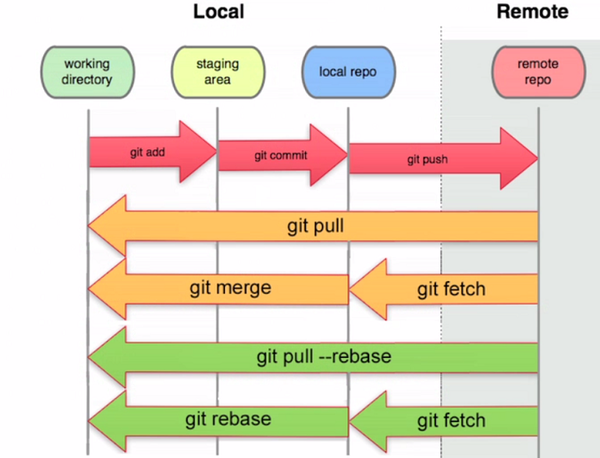

# git相關知識

- [Git 建立共用repo](https://github.com/doggy8088/Learn-Git-in-30-days/blob/master/zh-tw/03.md)
- [Git branch的操作](https://blog.gogojimmy.net/2012/01/21/how-to-use-git-2-basic-usage-and-worflow/)
- [Git初學者心得分享](http://www.mrmu.com.tw/2011/05/06/git-tutorial-for-beginner/)
- [Git中文化電子書](https://git-scm.com/book/zh-tw/v2)
- [Git視覺化遊戲](http://learngitbranching.js.org/)

# A. 概念
## 1. 名詞定義
branch | 說明
------ | ------
master | 本地端分支的預設名稱
origin | 遠端repo的預設名稱

## 2. 遞交流程



## 3. 層級
層級       | 指令     | 說明
--------- | -------- | ---
儲存庫層級 | --local  | 只對目前的repo有效(default)
使用者層級 | --global | 對目前使用者有效
系統層級   | --system | 對所有使用者/儲存庫都有效


## 4. Merge 與 Rebase
> Merge: `合併後, 分支仍然存在`
```sh
$ git branch
* master
  tony

$ git merge tony
...(一堆log)...
```

> Rebase: `合併後, 分支與 master在相同 index`
```sh
$ git branch tony
  master
* tony

$ git rebase master         # 把 tony搬到 master的下一個階段
...(一堆log)...

$ git checkout master

$ git rebase tony           # 把 (落後的)master, 合併到 tony
```

## 5. 組態檔可能存在於3個地方
1. /etc/gitconfig
2. ~/.gitconfig、~/.config/git/config
3. 專案裏頭的.git/config

## 6. 取消追蹤特定檔案
將檔名加到 `.gitignore`即可
```sh
$ vi .gitignore     # 把檔名加入.gitignore即可
```

# B. 設定指令

## 1. 設定別名
> 指令: `git config --<層級> alias.<縮寫名稱> <原始指令>`
```sh
$ git config --global alias.cm "commit -m"
# 將來可用 git cm "..." 來代替 git commit -m "..."

$ git config --global alias.unstage "reset HEAD --"     # 將檔案從 index中移除
# 將來可用 git unstage a.js 來取代 git reset HEAD a.js

$ git config --global alias.undo "reset --soft HEAD~1"  # 取消最近一次提交
# 將來可用 git undo a.js 來取代 git reset --soft HEAD~1 a.js

$ git config --global alias.tree "log --graph --decorate --pretty=oneline --abbrev-commit"
# 將來可用 git tree 來漂亮的看提交紀錄
```

## 2. 移除別名
> 指令: `git config --<層級> --unset alias.<已建立的別名>`

## 3. 必用
```
$ git config --global user.name "TonyCJ"
$ git config --global user.email "cool21540125@gmail.com"
$ git config --list
    user.name=TonyCJ
    user.email=cool21540125@gmail.com
```

## 4. 忽略「空白」所造成的影響
```sh
$ git config --global apply.whitespace nowarn
```

## 5. 增加Git輸出時的顏色
```sh
$ git config --global color.ui true
```

## 6. 遠端連線設定 (For Windows)
```sh
> ssh-keygen -t rsa -C '<e-mail>'
# -C 是指讓識別碼以email為識別值, 而非預設的「帳號@遠端主機位址」
```

# C. 指令彙整
## 1. 選項
選項 | 說明 | 範例 
--- | --- | ---
-s | 簡易資訊 | git status -s


## 2. 參數
 參數   |      說明       | 範例
 ------ | -------------- | ---
 --blob |                |
 --f    |                |
 --list | 顯示組態設定值  | 

# D. 操作指令
## 1. 建立新的git repo
> 參考: [共用儲存庫](https://ithelp.ithome.com.tw/articles/10132804)
```sh
$ git init
$ git init --bare
```


## 2. 鎖定遠端repo、遠端repo追蹤
```sh
$ git init
$ git add README.md
$ git commit -m 'xxx'
$ git remote add origin https://github.com/cool21540125/illu.git
$ git push -u origin master
```

## 3. 加入至stage狀態
```sh
$ git add -i    # 建議使用互動式模式來加入檔案到stage狀態
$ git add .     # (不建議使用, 請用上者來代替)
```

## 4. 回到過去
```sh
$ git branch -f master HEAD~3
# 強制移動master指向從HEAD往上數的第3個parent commit
```

## 5. 清理檔案庫
Git經過一段時間之後, .git的資料夾會變得無比的巨大, 可以使用下列指令來清理此檔案庫, 指令為
```sh
$ git gc
```

option       |                 說明
------------ | ----------------------------------------
N/A          | (預設) 會用比較快速的方式檢查&&清理
--aggressive | 最慢、最仔細
--auto       | Git自動判斷是否需要清理, 情況良好則不動作
--no-prune   | 不要清除repo, 而是用整了的方式


# E. 其他
## 1. 這幹嘛的我忘了...
```sh
$ git branch -f master HEAD~3
# -f 選項直接讓分支指向另一個 commit
```