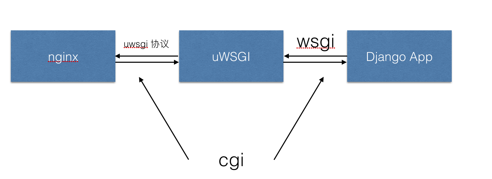

# Web Server (Python 觀點)
- 2018/05/18
- [What is the point of uWSGI?
](https://stackoverflow.com/questions/38601440/what-is-the-point-of-uwsgi?utm_medium=organic&utm_source=google_rich_qa&utm_campaign=google_rich_qa)
- [python server比較](https://www.digitalocean.com/community/tutorials/django-server-comparison-the-development-server-mod_wsgi-uwsgi-and-gunicorn)
- [寫得很棒的Web Server/App Server - RoR觀點](https://github.com/evenchange4/blog/blob/master/source/_posts/Ruby/2013-07-04-server.md)
- [我覺得寫得很棒的 WSGI解說](https://github.com/uranusjr/django-tutorial-for-programmers/blob/1.8/02-how-does-django-work.md)
- [gunicorn 組態(中文)](https://tw.saowen.com/a/c85254c32f134b6654a89b72971d5d5ace28d99d63c29f134639d5010141bd4e)

## 比較 
- uWSGI: `純 Python的 Web Server`. 本身很大一包, **好像** 只能在 Linux上面運行.
- WSGI : `python web 框架` 需邀遵照的協議 (基本上, web service開發人員不用理這個...)
- uwsgi: `python base Web Server` 與 `Reverse Proxy Server(Nginx)` 溝通的協定 (應該吧!?)

[圖片來源在這 - 我覺得他寫的很棒~](https://www.rapospectre.com/blog/31)

---------------------------
## WSGI

`Flask`、`Django` 本質上就是一個 `WSGI Application`, 用來與 `WSGI Server`溝通. 當`WSGI Server`被啟動時, 會進行以下動作:

1. 初始化
2. Start Loop, 等候 request
3. 等到請求後, 呼叫 `WSGI Application`, 開始一系列處理, 並 send request
4. back to Loop
5. repeat 2-4 到死

